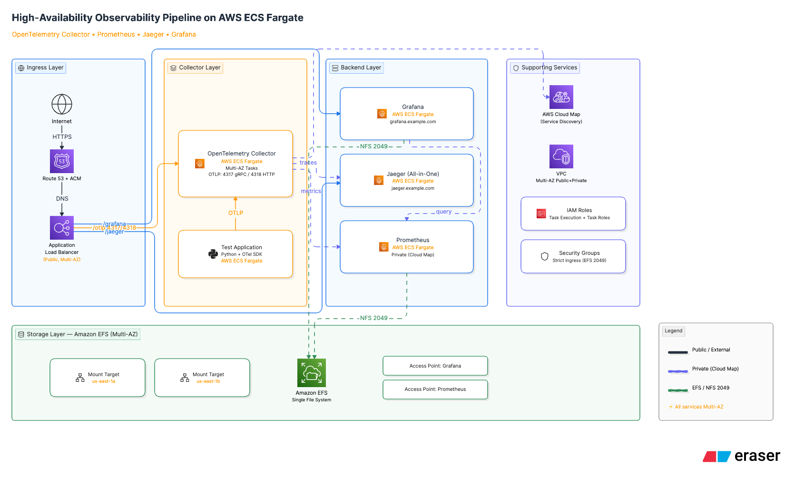

# High-Availability Observability Pipeline on AWS Fargate
### Prometheus, Jaeger, Grafana, and OpenTelemetry Collector Architecture

A production-ready, highly isolated, 11-layered Infrastructure as Code (IaC) deployment engineered to implement distributed tracing, metrics collection, and centralized visualization. This repository implements an end-to-end telemetry mesh using the OpenTelemetry (OTel) standard, serving as an advanced demonstration of modern Site Reliability Engineering (SRE) paradigms and cloud architecture optimization.

---

## 🏗️ System Architecture & Topologies

This system establishes a decoupled telemetry pipeline. Applications emit OTLP (OpenTelemetry Protocol) telemetry to a centralized **OpenTelemetry Collector Contrib** cluster. The collector intelligently parses, processes, and dispatches traces upstream to **Jaeger** (via secure gRPC) and metrics to a distributed **Prometheus** server (via remote write), with **Grafana** providing unified visual intelligence and trace-to-metrics correlation.




### Decoupled 11-Layer Pipeline Matrix
The project is decoupled into 11 sequentially dependent infrastructure layers to maintain isolated blast radiuses and clear state bridges:

1. **`01-vpc`**: Core network base layout (VPC, IGW, and Route Tables).
2. **`02-network`**: Subnet layouts, Route Table associations, and Private AWS Cloud Map DNS namespaces.
3. **`03-storage`**: Durable backing data volumes, Elastic File System (EFS) configurations, and access points for retention.
4. **`04-iam`**: Least-privilege IAM Task and Execution roles, and centralized security policy attachments.
5. **`05-acm-route53`**: Domain registration hooks, Route 53 zones, and ACM SSL/TLS cryptographic certificate generation.
6. **`06-alb`**: Public-facing Application Load Balancer, routing rule matrices, and target groups.
7. **`07-otel-collector`**: Core OTel Ingestion sidecar engine running on ECS Fargate with custom OTLP/gRPC configurations.
8. **`08-obs-jaeger`**: Distributed trace storage engine and query interface endpoints.
9. **`09-prometheus`**: Time-series metrics engine with active remote-write API ingestion channels.
10. **`10-grafana`**: Centralized visualization control room panel cluster.
11. **`11-test-app`**: Distributed mock Python application emitting live multi-span synthetic workloads.

---

## 🎯 Engineering & SRE Objectives

* **Zero-Trust Telemetry Mesh:** Isolate back-end storage engines (Prometheus/Jaeger) entirely from the public internet using private AWS Cloud Map DNS discovery.
* **Decoupled Multi-Layer IaC:** Enforce a strict state separation across 11 modules to prevent monolithic deployment failures and optimize resource lifecycle management.
* **End-to-End Context Propagation:** Validate trace context propagation from a distributed runtime application, mapping downstream spans through the collection tier into storage with perfect structural integrity.
* **FinOps Operational Efficiency:** Architect a secure sandbox topology that eliminates high baseline managed networking costs while maintaining rigorous application transport filtering.

---

## 🛠️ Deployment & Execution Guide

### Pre-Requisites
1. Installed binaries: `terraform` (>= v1.0), `aws-cli`, and `git`.
2. Active AWS credentials configured with appropriate Administrative/PowerUser execution rights.

### Step 1: Initialize Configuration Boundaries
From your local workspace terminal, move to your central state configuration folder:
```bash
cd terraform/layers
cp ../central.tfvars.example ../central.tfvars

Configure your terraform/central.tfvars file. The repository comes pre-packaged with safe, production-mode default allocations:

Terraform
project_name        = "aws-prometheus-grafana-otel-collector-v1"
region              = "us-east-1"
aws_region          = "us-east-1"
environment         = "dev"
vpc_cidr            = "10.0.0.0/16"
availability_zones  = ["us-east-1a", "us-east-1b"]
domain_name         = "sreconcepts.com"
create_ssl_cert     = false

Option A: Fully Automated Deployment (Recommended)
To execute an automated, orchestrated cold-build of all 11 infrastructure layers in their correct dependency sequence, execute the root bootstrap script from the repository base:

Bash
# Executed from AI-Automation-Projects/aws-prometheus-grafana-otel-collector-v1/
chmod +x build-all-layers.sh
./build-all-layers.sh
This script sequences the execution, runs automated validation checks at each layer interface, and ensures the system boots into a fully healthy state.

Option B: Manual Step-by-Step Layer Pipeline
If you prefer to dry-run or manually apply individual layers to inspect the execution graphs, execute them in this exact order:

Bash
# Executed from terraform/layers/
VAR_FILE="../central.tfvars"

cd 01-vpc && terraform init && terraform apply -var-file=$VAR_FILE -auto-approve
cd ../02-network && terraform init && terraform apply -var-file=$VAR_FILE -auto-approve
cd ../03-storage && terraform init && terraform apply -var-file=$VAR_FILE -auto-approve
cd ../04-iam && terraform init && terraform apply -var-file=$VAR_FILE -auto-approve
cd ../05-acm-route53 && terraform init && terraform apply -var-file=$VAR_FILE -auto-approve
cd ../06-alb && terraform init && terraform apply -var-file=$VAR_FILE -auto-approve
cd ../07-otel-collector && terraform init && terraform apply -var-file=$VAR_FILE -auto-approve
cd ../08-obs-jaeger && terraform init && terraform apply -var-file=$VAR_FILE -auto-approve
cd ../09-prometheus && terraform init && terraform apply -var-file=$VAR_FILE -auto-approve
cd ../10-grafana && terraform init && terraform apply -var-file=$VAR_FILE -auto-approve
cd ../11-test-app && terraform init && terraform apply -var-file=$VAR_FILE -auto-approve

📈 Initial Setup of Grafana Data Sources & Dashboards
Once your 11 layers are live, access Grafana via your public ALB endpoint (e.g., http://<ALB-DNS-NAME>/grafana or http://grafana.sreconcepts.com). Log in with your provisioned administrator credentials (admin/admin) to onboard your telemetry storage engines.

1. Register Data Sources
Data Source A: Prometheus
Navigate to Connections > Data sources > Add data source and select Prometheus.

Configure the Connection URL using your private Cloud Map internal DNS routing scheme:

Plaintext
[http://prometheus.aws-prometheus-grafana-otel-collector-v1.internal:9090](http://prometheus.aws-prometheus-grafana-otel-collector-v1.internal:9090)
Set Scrape interval to 10s.

Click Save & test. You should see a green verification message: “Data source is working”.

Data Source B: Jaeger
Click Add data source and select Jaeger.

Set the internal routing query endpoint URL:

Plaintext
[http://jaeger.aws-prometheus-grafana-otel-collector-v1.internal:16686](http://jaeger.aws-prometheus-grafana-otel-collector-v1.internal:16686)
Click Save & test to verify internal network connectivity.

2. Build the SRE Collector Dashboard Control Room
Create a new dashboard and construct these 5 vital structural metrics panels. This verifies the complete health and throughput profile of your OTel infrastructure.

Panel 1: Collector Instance Status
Visualization: Stat Panel
PromQL Query: up{job="otel-collector"}
Configuration: Set Thresholds to 1 = Green (Online), 0 = Red (Offline).

Panel 2: Collector Process Uptime
Visualization: Stat Panel
PromQL Query: otelcol_process_uptime
Configuration: In Standard Options, change the color scheme from From thresholds (by value) to Single color and select Green. This locks the status to a stable green line as uptime values scale.

Panel 3: Inbound Span Throughput
Visualization: Time Series Line Chart
PromQL Query: sum(rate(otelcol_receiver_accepted_spans[1m])) by (receiver)
Operational Expectation: Displays the live ingestion curve of your active Python applications (typically averaging 3.5 to 4 ops/s).

Panel 4: Processor Refused Spans (Saturation Guard)
Visualization: Time Series Line Chart
PromQL Query: sum(rate(otelcol_receiver_refused_spans[1m])) by (processor) or vector(0)
Operational Expectation: Flatline at 0. The appended or vector(0) operator ensures that if lazy initialization prevents the metric from creating during healthy phases, it safely outputs a functional zero rather than failing with an empty "No Data" panel state.

Panel 5: Exporter Send Failures (Egress Reliability)
Visualization: Time Series Line Chart
PromQL Query: otelcol_exporter_send_failed_spans or vector(0)
Operational Expectation: Flatline at 0. Confirms network and interface stability to downstream targets.

🔬 SRE Validation Matrix (How To Test)
To confirm your deployment operates at high standards, execute these three testing phases sequentially:

Phase 1: Network & Blast Radius Isolation (The Front-Door Test)
Attempt to curl Prometheus or Jaeger query endpoints directly from your local network using their private Cloud Map IPs found via the AWS ECS Console.

Bash
curl -m 5 [http://10.0.](http://10.0.)X.X:9090
Expected Result: Connection timeout. This confirms that your security groups and private subnet matrices are strictly containing your storage systems.
Hit the public-facing ALB on an unmapped custom endpoint route.
Expected Result: 404 Not Found or a standard default gateway deny page. This confirms that path-based validation is tightly enforced at your proxy routing layer.

Phase 2: Reliability & Fault-Tolerance (Task Assassination Chaos)
Verify via the AWS Console that your running ECS Fargate tasks are distributed uniformly across your availability zones (us-east-1a and us-east-1b).
Simulate an ungraceful hardware degradation event by terminating your active otel-collector-service task container via the AWS CLI or ECS dashboard:
Bash
aws ecs stop-task --cluster <YOUR_CLUSTER_NAME> --task <TASK_ID>
Observe Self-Healing Performance: * Watch the ALB Target Groups instantly catch the drop and transition the target state to unhealthy.
Track the Fargate infrastructure engine automatically trigger a fresh cold-start instance replacement container.
Verify that Grafana metrics smoothly resume streaming within seconds as the new instance automatically registers itself to the active Cloud Map internal DNS address.

Phase 3: Operational Excellence & Context Propagation
Access your 11-test-app runtime container logs via Amazon CloudWatch Logs and harvest a live, generated trace_id string.
Copy that exact ID payload, log into your Jaeger UI control dashboard (http://<ALB-DNS-NAME>/jaeger), and execute an explicit ID lookup search query.
Expected Result: The multi-tiered trace context hierarchy renders across spans. This cleanly proves that your application instrumentation layer, upstream gRPC collector transport networks, and backend Jaeger storage blocks are tracking and executing context propagation perfectly.

🏛️ AWS Well-Architected Framework Alignment
1. Security & Blast Radius Isolation
Network Containment: All underlying telemetry storage arrays (Prometheus/Jaeger engines) are locked down inside private network namespaces. They are entirely inaccessible from outside the VPC.
Security Group Micro-Segmentation: Ingress into the OpenTelemetry Collector is strictly restricted to incoming applications on explicit container ports (4317 gRPC / 4318 HTTP).
Least-Privilege Roles: Separate IAM Execution Roles (for ECS agent log creation and ECR image pulls) and IAM Task Roles (granting the container runtime only the permissions it needs to execute) are utilized.

2. Reliability & Fault Tolerance
High Availability Topology: ECS Fargate tasks are automatically distributed across multiple Availability Zones (us-east-1a and us-east-1b) to absorb localized infrastructure failures.
Self-Healing Container Runtimes: Implements native AOT pre-compiled healthcheck binaries inside the collector spec (["CMD", "/healthcheck"]), enforcing strict evaluation intervals. The Fargate scheduler automatically assassinates and replaces unhealthy tasks within seconds.
Aggressive Service Discovery: Cloud Map DNS discovery TTLs are restricted to 10 seconds, forcing rapid client-side cache clearing and continuous back-end re-routing during scaling operations or node failure events.

3. Cost Optimization (The FinOps Advantage)
Pragmatic Sandbox Engineering: To eliminate the continuous, high baseline hourly costs associated with dedicated AWS NAT Gateways in a personal test/demonstration sandbox, backend layers are provisioned within public-facing subnets utilizing strict Security Group firewalls.
Network-Level Security Enforcement: Security groups are configured with zero public ingress for the collector and storage platforms, providing the absolute minimum cloud financial footprint while maintaining enterprise-standard transport isolation.

4. Operational Excellence
Decoupled Sliced IaC: Moving away from a brittle, monolithic main.tf, this platform separates concerns into 11 independent state layers. Changes to visualization panels cannot cause destructive regressions to the baseline network configurations.
Immutable Configuration Control: Container references rely on explicit cryptographic or semantic image tags (v0.40.0) instead of mutable tags like latest, ensuring completely deterministic, repeatable builds.

5. Performance Efficiency
Native Telemetry Processing: The ingestion sidecar utilizes async memory-limited batch processing, packing telemetry payloads into efficient chunks before shipping to optimize network throughput and minimize CPU context switching.

🧹 Teardown & Decommissioning
To tear down all active AWS resources and clean your local repository of environment-specific states, execute the automated cleanup utility from the root directory:

Bash
chmod +x destroy-and-cleanup.sh
./destroy-and-cleanup.sh
This ensures complete resource reclamation and wipes all local sensitive state caches, leaving only clean .example blueprints safe for public version control distribution.